# Fast.ai
My code alongs, notes, and experiments accompanying the fast.ai courses [Practical Deep Learning For Coders, Part 1](http://course18.fast.ai/index.html) & [Cutting Edge Deep Learning For Coders, Part 2](http://course18.fast.ai/part2.html).

## Getting Started
### Prerequisites
Create a conda environment for fastai 0.7.0.

Install anaconda, clone the repository, navigate to the folder, and then run:

```
conda install nb_conda_kernels
conda env create -f env.yml
ipython kernel install --user --name=fastai
source activate fastai
```

The notebooks regarding *Transfer learning for NLP* and *Neural machine translation* require [fastText](https://github.com/facebookresearch/fastText/tree/master/python):

```
git clone https://github.com/facebookresearch/fastText.git
cd fastText
pip install .
```


## Contents

1. NLP
	1. Language models
		1. Transfer learning for NLP and sentiment analysis/text classification for the IMDb dataset
		2. Character-based language model (recurrent neural network) from scratch generating Nietzsche
		3. Character-based language model using GRU and LSTM cells
	2. Neural machine translation: seq2seq with Attention (Luong et al., 2015)
2. Computer vision
	1. Resnet architecture and batch normalization layer from scratch
	2. Darknet from scratch trained on Cifar10
	3. Class activation maps (CAM)
	4. Multi-label classification: Understanding the Amazon from space
	5. Object detection/single shot multibox detector
	6. Image segmentation with U-net from scratch
	7. DeViSE - A Deep Visual-Semantic Embedding Model
	8. Super-Resolution
3. Generative models
	1. Generative Adversarial Networks (GANS): Wasserstein GAN from scratch
	2. Style transfer
4. Recommender systems
	1. Collaborative filtering (probabilistic matrix factorization) 
5. Tabular/structured data analysis
	1. Forecast sales (Rossmann Store Sales Kaggle competition)

	
	
	

	


## NLP
### Language Models
#### Transfer learning for NLP and sentiment analysis/text classification for the IMDb dataset

1. Take a a pretrained language model (trained on wiki103).
2. Fine-tune it on i.e. movie reviews to predict the next word in a sequence of words.
3. Replace the decoder with a classifier and then train it to classify sentiment. (Did the viewer like the movie or not?)

The classifier achieves an accuracy of 94.6 %. 

*With this technique fastai not only simplified transfer learning for NLP but also set the new state-of-the-art.*

Example for the language model:

For the input sequence `". so , it was n't quite was i was expecting , but i really liked it anyway ! the best"` the predicted next words are `['part', 'thing', 'scene', 'way', 'parts', 'of', 'line', 'aspect', 'performance', 'scenes']`.


#### Character-based language model (recurrent neural network) from scratch generating Nietzsche
Building a character-based language model from scratch in PyTorch and training it on [Nietzsche](https://github.com/mbernico/lstm_bot/blob/master/lstm_bot/nietzsche.txt).

#### Character-based language model using GRU and LSTM cells
Building a character-based language model from scratch using PyTorch that *uses GRU (Gated recurrent unit) or LSTM cells*. Trained it on [Nietzsche](https://github.com/mbernico/lstm_bot/blob/master/lstm_bot/nietzsche.txt).

Example: A sequence started with *for those* is continued with *for those exclusion of the root of through their anth--life as yet grow theleops, again, difficulty, divined claal man, weel viced agrown,diffule, trained, and afwords of history of this all godand depth, to overlooks or to other. for this hand. how possiblity! so that one must necessarily responsible, sequently fredom!" or oven our culture to be expediency, instinct, rationary evidence, again philosophy--*. 

Ok, looks a little like Nietzsche but not quite there yet ;)

### Neural machine translation: seq2seq with Attention (Luong et al., 2015)
Seq2seq model with Attention mechanism, bidirectional model, and teacher forcing built from scratch in PyTorch and trained on a *french to english* dataset containing questions.

Examples in the order **input**, **target**, **predicted translation**:

```
pourquoi ? _eos_
why the best source ? _eos_
why ? _eos_

à qui pouvez - vous faire confiance ? _eos_
who can you trust ? _eos_
who can you trust ? ? _eos_

quels types de projets ? _eos_
what types of projects ? _eos_
what types of projects are _eos_

qu’ est -ce que le financement de projet ? _eos_
what is project funding ? _eos_
what is funding project ? _eos_

quels sont les avantages ? _eos_
what are the benefits ? _eos_
what are the benefits ? _eos_

pourquoi l’ inspection est-elle nécessaire ? _eos_
why is inspection necessary ? _eos_
why is the inspection necessary ? _eos_
```

**Visualizing the attention mechanism:**

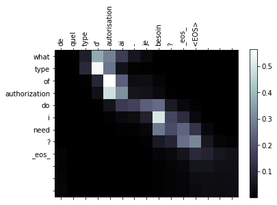


## Computer vision
### Resnet architecture and batch normalization layer from scratch
Built a **residual network** including **batch normalization** from scratch:

Instead of $a_{i+1} = f(a_{i})$ (activation of the next layer) calculate $a_{i+1} =a_{i} + f(a_{i})$. 

Resnet layer tries to learn a set of conv filters that estimate the residual/error/how much it was off by and adds that to the activations of the pref layer.

$f(a_i) = \underbrace{a_{i+1} - a_{i}}_{\text{residual}}$


### Darknet from scratch trained on Cifar10
Building a *Darknet* (resnet-ish architecture used in YOLOv3) from scratch using PyTorch and training it on Cifar10. Reaches 91.2% accuracy within 19 min of training on GTX 1080 Ti.


### Class activation maps (CAM)
A class activation map shows which regions in the image are relevant to a specific class.

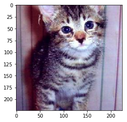 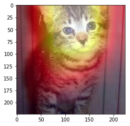 

### Multi-label classification: Understanding the Amazon from space
[Kaggle competition](https://www.kaggle.com/c/planet-understanding-the-amazon-from-space) with the goal to use satellite data to track the human footprint in the Amazon rainforest.

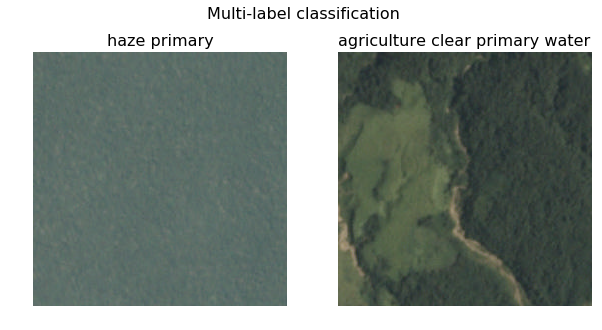

### Object detection/single shot multibox detector

Read my blog post explaining [SSD - single shot multibox detection](https://towardsdatascience.com/retinanet-how-focal-loss-fixes-single-shot-detection-cb320e3bb0de) in detail.

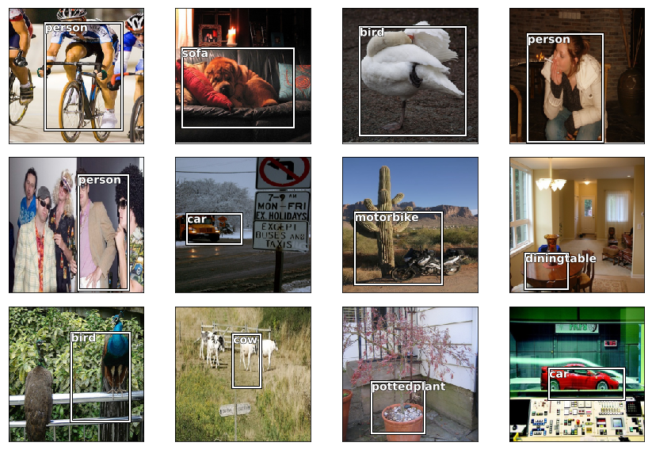


### Image segmentation with U-net from scratch
Build a U-net from scratch using PyTorch and training it to segment cars from background.

Labeled traning dataset:

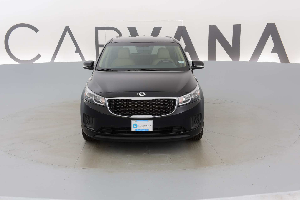 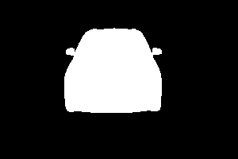

Prediction after traning (different car):

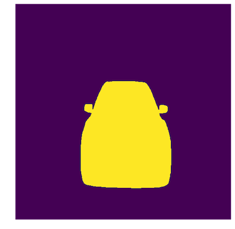


### DeViSE - A Deep Visual-Semantic Embedding Model
This model bridges the divide between text and images, using them both in the same model!

Test my [model deployed on AWS](http://ec2-18-195-116-70.eu-central-1.compute.amazonaws.com:8000/apidocs/) and read my blog post.

### Super-Resolution
Use deep learning to restore high resolution details in images/improve the details within an image.

(Could probably be get even better with longer training.)

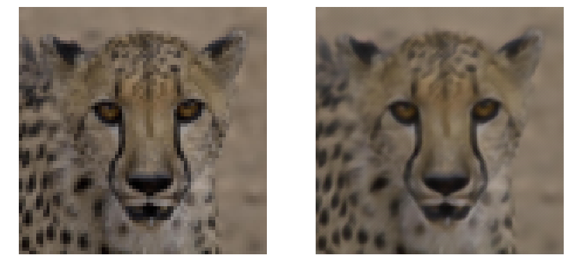
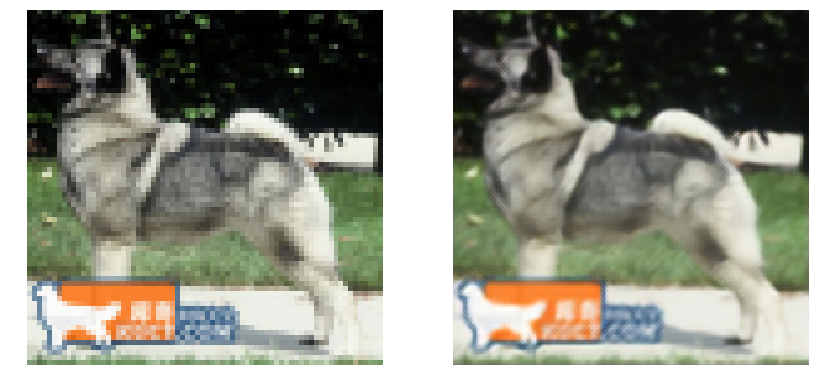


## Generative models

### Generative Adversarial Networks (GANS): Wasserstein GAN from scratch
Build a WGAN from scratch using PyTorch and train it to generate pictures of *bedrooms*:

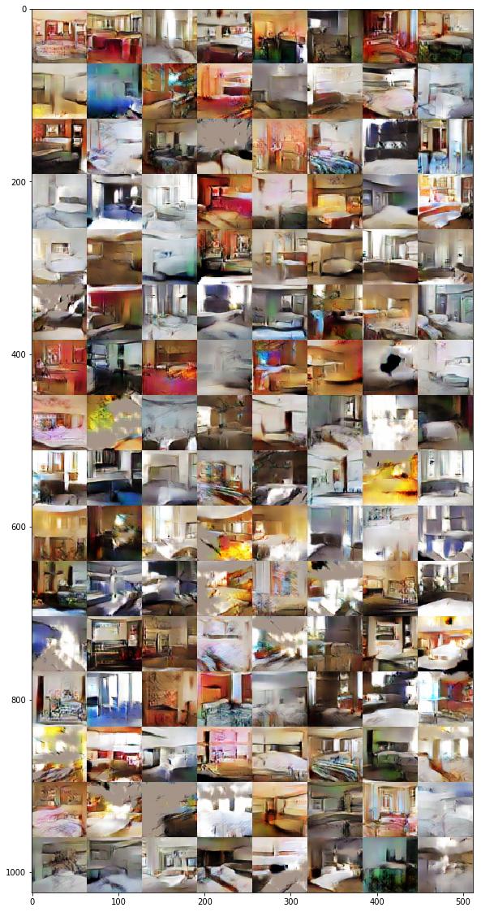

### Style transfer
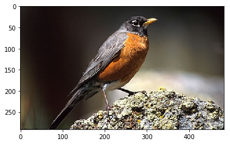 **plus**  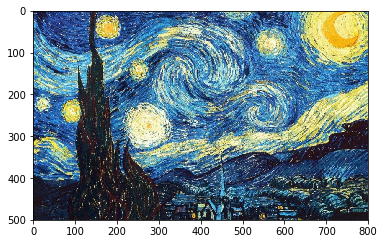

**gives:**

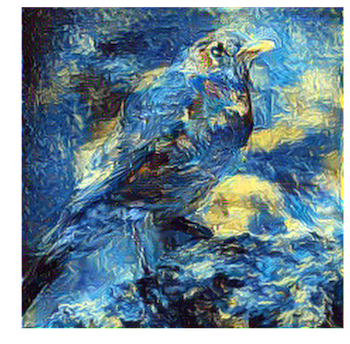


## Recommender systems
### Collaborative filtering (probabilistic matrix factorization)

Building a recommender system (through the example of making movie recommendations) from scratch using PyTorch and training it on the movielens dataset.

[Collaborative filtering](https://en.wikipedia.org/wiki/Collaborative_filtering) allows making automatic predictions (filtering) about the interests of a user by collecting preferences or taste information from many users (collaborating). The underlying assumption of the collaborative filtering approach is that if a person A has the same opinion as a person B on an issue, A is more likely to have B's opinion on a different issue than that of a randomly chosen person.

Example: Analyzing the collaborative filtering bias term  after training allows quick identification of the best and worst movies ever:

Best:

```
(1.2412809, 'Shawshank Redemption, The (1994)'),
 (0.91640526, 'Forrest Gump (1994)'),
 (0.91200024, 'Star Wars: Episode IV - A New Hope (1977)'),
 (0.90508574, 'Dark Knight, The (2008)'),
 (0.8919806, 'Goodfellas (1990)'),
 (0.8825537, 'Raiders of the Lost Ark (Indiana Jones and the Raiders of the Lost Ark) (1981)'),
 (0.86630696, 'Pulp Fiction (1994)')]
```

Worst:

```
[(-0.7477656, 'Anaconda (1997)'),
 (-0.7290815, 'Catwoman (2004)'),
 (-0.69919705, 'Stuart Saves His Family (1995)'),
 (-0.69020677, 'Speed 2: Cruise Control (1997)'),
 (-0.68665266, 'Godzilla (1998)'),
 (-0.6827628, 'Spice World (1997)')]
```

This is a very authentic way to judge movies! Some people are more critical, but might watch only certain types of movies. This movie bias is corrected for different levels of such viewer sentiment and different types of movies different reviewers watch!


## Tabular/structured data analysis
### Forecast sales (Rossmann Store Sales Kaggle competition)
Kaggle competition [Rossmann Store Sales](https://www.kaggle.com/c/rossmann-store-sales). Forecast sales using store, promotion, and competitor data.


